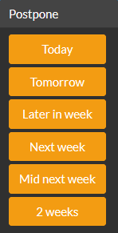

# Grabtangle Cloud

## What is it?

This is a small, very simple, yet-another Todo-application for short-term day-to-day task tracking. It is inspired by the [Getting Things Done (GTD)](https://gettingthingsdone.com/) philosophy by David Allen.

The application is not revolutionary in any way but supports a productivity philosophy which I find very useful. To use the infamous 80-20-principle: 

* 80% is to follow a productivity philosophy
* 20% is some kinds of tooling (this app?) which acts as the "filing system" in GTD

The application is also inspired by the now-defunct Google Inbox product (R.I.P.) in the sense that you postpone tasks with a few relative time options
(Also, I really hate date pickers).

Note that you should always consider moving tasks to other systems when applicable. For example, scheduling meetings can be done in Outlook, more extensive notes should be kept other places and long-term goals should be documented separately.

This is purely to keep track of your short/mid-term memory!

## How to use?

At the core, just adapt the GTD-philosophy or at least the parts you like :)
Be sure to keep the tool handy so that you can jot down anything that can be of interest to you. Some other key areas are described in the following sections:

### Clear actions!

One of the most important principles that should be followed is to create very specific action increments that are clearly described and easy to follow-up. I think this is one of the most important tip.

### "2 - 20 - 20" rules / guidelines

Some guiding principles that I find useful to follow and which is partly reflected in the tool are the following:

* 2 minutes (from GTD) - if something takes less than this - do the task at once without recording it
* 20 tasks - maximum number of tasks to keep without losing focus
* 20 days `beta` - maximum number of days the action should be unchanged for - if you have a lot of old tasks you're probably using it the wrong way - currently testing this rule

At the end of each workday - the `Today` tab should ideally be empty. Postpone or redefine actions if needed.

### Completion == Deletion

Whenever you have no further actions on a certain topic - you complete it and forget it. In essence - the tool deletes it from the database. There is absolutely no reason to keep a log or reports of this, it's in the past now and you are moving on to other things.

### Waiting?

One of the things I didn't find particularily useful in the GTD philosophy is to have a "Waiting" category. You should consider completing it instead since you will be triggered by another person whenever you get a response or answer. Consider making a new task at that point instead of filling up the list.

### Features

* Cloud-based storage with Firebase gives instant updates across all logged
* Supports Firebase Auth and a number of providers for easy on-boarding
* Responsive design - should work on mobile and desktops alike
* Easy to use interface (since the app is so basic)
* No date pickers! - Postpone instead ;)

## Technologies

Summary of technologies used for the application

### Development

* [React](https://reactjs.org/) for the front-end - bootstrapped with [Create React App](https://github.com/facebook/create-react-app)
* [React Bootstrap 4](https://reactstrap.github.io/) for responsive layout, components and styling
* [Bootswatch](https://bootswatch.com/) for theming
* [React Firebase UI](https://github.com/firebase/firebaseui-web-react) for authentication flow and dialogs
* [React Firebase](https://react-firebase-js.com/docs/react-firebase-realtime-database/getting-started) for handling the Firebase JDK in React

### Database and hosting

* [Firebase Hosting](https://firebase.google.com/docs/hosting) for hosting the Web application
* [Firebase Realtime DB](https://firebase.google.com/docs/database) for storage and backend

## Tutorials

* Very useful tutorials on React and Firebase by [Robin Wieruch](https://www.robinwieruch.de/)

# Building

If you are interested in building this application for some weird reason, please see the [build instructions](BUILD.md).
